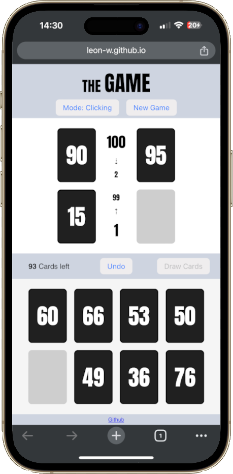

# the-game

[**🚀 Play here 🚀**](https://leon-w.github.io/the-game/)

React implementation of the card game 'The Game' (single player).

	

## Rules

The goal of 'The Game' is to play all 98 cards (with the numbers 1 to 98 on them) into four piles, two ascending and two descending, from 1 to 100 and back again.

**Setup:** The 98 cards are shuffled. You start with 8 hand cards. The remain hidden in a draw pile.

**Gameplay:** On your turn, you must play at least two cards from your hand onto any of the four piles on the table. You can play more than two cards if you wish, but you must play at least two. The turn ends with you drawing back up to 8 cards.

_Card Placement Rules:_

-   Ascending piles: Cards must be played in ascending order, from 1 to 100.
-   Descending piles: Cards must be played in descending order, from 100 to 1.
-   If the difference between the card you play and the top card of the pile is exactly 10, you can play the card on the pile.

**Winning:** The game ends when you can no longer legally play any cards from your hand onto the piles. Your goal is to play all 98 cards. The remaining cards (if any) can be seen as a score of how well you did.
